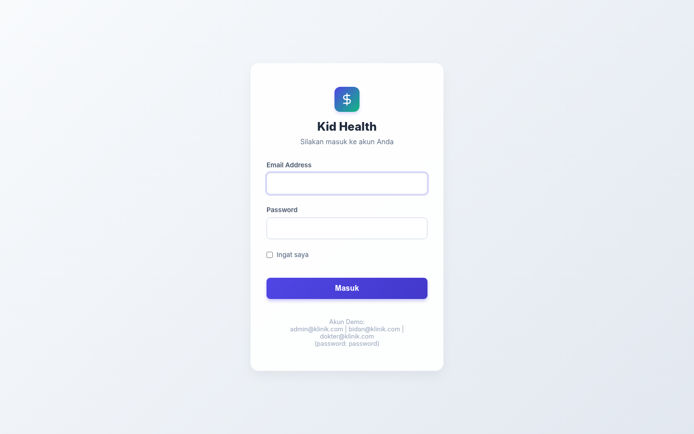
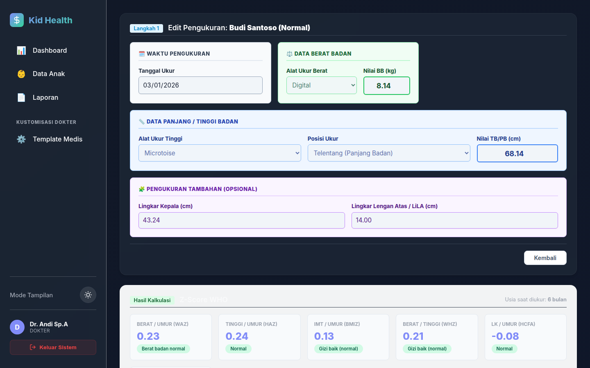
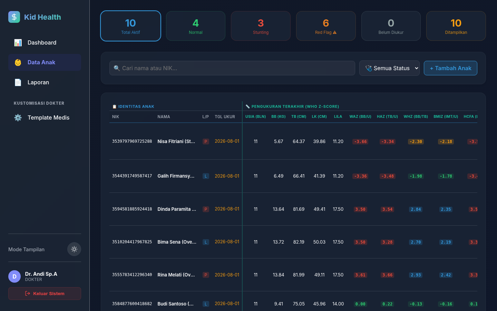
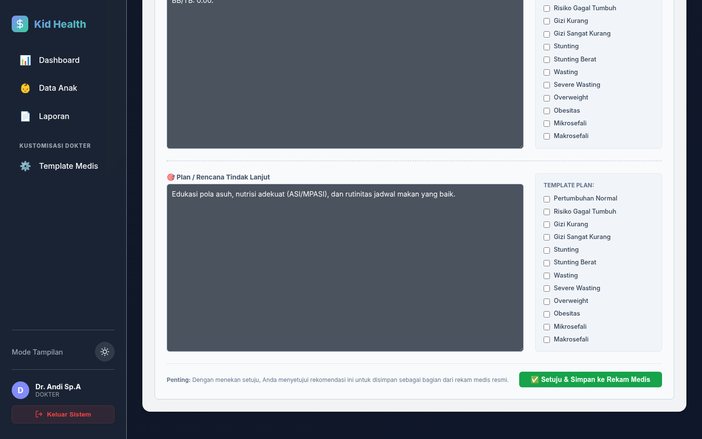

# Buku Manual Pengoperasian: Monitoring Health Kid

Selamat datang di panduan penggunaan aplikasi **Monitoring Health Kid**. Panduan ini dirancang khusus untuk memandu para tenaga kesehatan (Bidan/Perawat dan Dokter Anak) dalam menggunakan sistem untuk memantau tumbuh kembang anak secara presisi berdasarkan standar WHO.

---

## 1. Akses dan Login Sistem

Langkah pertama untuk menggunakan sistem ini adalah masuk (login) ke dalam dasbor menggunakan kredensial yang telah diberikan oleh administrator fasilitas kesehatan Anda.

> [!IMPORTANT]
> Pastikan Anda menggunakan akun yang sesuai dengan peran (Role) Anda, baik sebagai Bidan (untuk penginputan data) maupun Dokter (untuk analisis medis).

**Langkah-langkah Login:**
1. Buka tautan aplikasi di web browser Anda.
2. Masukkan **Alamat Email** yang terdaftar.
3. Masukkan **Kata Sandi (Password)** Anda.
4. Klik tombol **Sign In**. Jika berhasil, Anda akan langsung diarahkan ke Dasbor Utama.

---

## 2. Alur Kerja Bidan: Melakukan Pengukuran

Setelah pasien anak tiba di fasilitas kesehatan, tugas Bidan atau Perawat adalah melakukan pengukuran antropometri dasar dan mencatatnya ke dalam sistem agar nilai Z-Score dapat dikalkulasi secara real-time.

**Langkah-langkah Input Pengukuran:**
1. Di panel navigasi sebelah kiri, pilih menu **Pasien (Patient Registry)** atau langsung cari nama anak di kolom pencarian dasbor.
2. Klik tombol **Tambah Pengukuran Baru**.
3. Isi data antropometri aktual anak pada formulir yang tersedia:
   - **Berat Badan (BB)** dalam satuan Kilogram (kg).
   - **Tinggi/Panjang Badan (TB/PB)** dalam satuan Sentimeter (cm).
   - **Lingkar Kepala (LK)** dalam satuan Sentimeter (cm).
   - **Lingkar Lengan Atas (LiLA)** (Opsional, jika ada indikasi khusus).
4. Klik **Calculate Z-Score** (Atau Simpan). Sistem akan otomatis mengirimkan data ini ke mesin kalkulator WHO di latar belakang dan memunculkan indikator status gizi dasar.
5. Klik **Save & Record** untuk menyimpan riwayat permanen anak tersebut.

---

## 3. Alur Kerja Dokter: Analisis & Tinjauan Dasbor

Setelah data dimasukkan oleh bidan, Dokter Spesialis Anak (Sp.A) dapat membuka sistem untuk memantau ringkasan klinis seluruh pasien yang masuk pada hari tersebut.

> [!TIP]
> Perhatikan lencana peringatan warna (Merah untuk Bahaya, Kuning untuk Waspada) pada baris pasien. Ini adalah fitur *Red Flag* otomatis yang memperingatkan dokter akan adanya anomali tumbuh kembang berdasarkan perhitungan persentil WHO.

**Langkah-langkah Analisis Data:**
1. Masuk ke menu **Dasbor Utama (Dashboard)**.
2. Anda akan melihat tabel **Child Growth Measurements**.
3. Di dalam tabel ini, Anda dapat memantau secara langsung 5 indikator WHO yang telah dihitung secara otomatis oleh sistem:
   - **WAZ (BB/U):** Indikator Berat Badan menurut Umur.
   - **HAZ (TB/U):** Indikator Tinggi Badan menurut Umur (Deteksi Stunting).
   - **WHZ (BB/TB):** Indikator Berat Badan menurut Tinggi Badan (Deteksi Wasting/Obesitas).
   - **BMIZ (IMT/U):** Indeks Massa Tubuh.
   - **HCFA (LK/U):** Indikator Lingkar Kepala menurut Umur (Deteksi Makrosefali/Mikrosefali).
4. Klik pada nama pasien atau tombol **Detail/Rekam Medis** untuk masuk ke halaman grafik visualisasi individual anak.

---

## 4. Alur Kerja Dokter: Diagnosa & Rencana Tindak Lanjut

Di halaman detail anak, setelah dokter meninjau kurva pertumbuhan, langkah terakhir adalah memberikan **Assessment (Diagnosa)** dan menyusun **Medical Plan (Tindak Lanjut)**.

> [!NOTE]
> Sistem dilengkapi dengan *Template Engine* pintar. Jika sistem mendeteksi adanya *Red Flag* (contoh: status anak Stunting atau Wasting), kolom Assessment dan Plan akan **terisi otomatis secara draf (Draft)** dengan rekomendasi medis standar. Dokter dapat langsung mengedit draf tersebut.

**Langkah-langkah Pemberian Tindak Lanjut:**
1. Scroll ke bagian bawah halaman detail/grafik anak, atau klik tab **Tindak Lanjut (Medical Plan)**.
2. Pada kolom **Assessment (Diagnosis & Analisis Medis)**, tuliskan kesimpulan medis dari hasil pembacaan grafik dan pemeriksaan fisik. Jika sudah ada draf otomatis dari sistem, silakan sesuaikan dengan kondisi klinis pasien.
3. Pada kolom **Medical Plan (Rencana Tindak Lanjut & Terapi)**, berikan instruksi spesifik. Contoh:
   - Resep suplemen atau vitamin (Zat Besi, Vitamin A, dll).
   - Edukasi gizi seimbang untuk orang tua.
   - Jadwal periksa darah (jika diperlukan).
   - Penjadwalan tanggal kontrol bulan depan.
4. Jika sudah selesai, klik tombol **Save Medical Plan**.
5. Diagnosa dan rencana ini nantinya dapat dicetak ke dalam format PDF untuk diberikan kepada orang tua.
